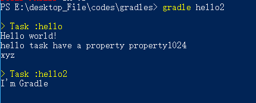

# 自动化构建

### 构建（打包）
在计算机科学中，软件组建（Software build），又译为软件建构、软件构筑，意指由源代码档案转换成可以在电脑上执行的软件这中间的过程，或是转换后的结果。软件组建中最重要的一个步骤，就是由源代码转换为可执行机器码这之间的编译过程。为了进行版本控制，在执行完软件组建，之后释出的软件程式，通常会给与一个软件版本号。

### 自动化构建
组建自动化（Build automation，又称构建自动化、自动化构建）指自动创建软件组建的一组进程，包括将计算机源代码编译成二进制码（binary code）、將二进制码包装成软件包以及运行自动化测试。

* 自动化构建工具 通过编译和链接源代码等活动来生成软件包。如Make、Rake、Cake、MS build、Ant、Gradle等。

* 自动化构建服务器 基于Web的通用工具能够在预定或触发的基础上执行组建自动化实用程序。持续集成是组建自动化服务器的类型之一。如Jenkins。

# 安装

* 下载JDK，配置JAVA_HOME环境变量
* 下载[gradle 官网](http://www.gradle.org/downloads)相应的Gradle版本gradle-x.xx-all.zip 解压
* 配置环境变量GRADLE_HOME，配置%GRADLE_HOME%/bin 到path

JVM 选项可以通过设置环境变量来更改. 可以使用 GRADLE_OPTS 或者 JAVA_OPTS.

* JAVA_OPTS 是一个用于 JAVA 应用的环境变量. 一个典型的用例是在 JAVA_OPTS 里设置HTTP代理服务器(proxy),
* GRADLE_OPTS 是内存选项. 这些变量可以在 gradle 的一开始就设置或者通过 gradlew 脚本来设置.

# 构建脚本基础

### 项目（projects）和任务（tasks）
每一个构建都是由一个或多个 projects 构成，每一个 project 是由一个或多个 tasks 构成的
。每个task代表了构建过程当中的一个原子性操作
### Hello World
创建一个build.gradle，编写如下内容:

```gradle
task hello {
    doLast {
        println 'Hello world!'
    }
}
```
注意 << 将被弃用，使用该操作符会显示运行警告：

The Task.leftShift(Closure) method has been deprecated and is scheduled to be removed in Gradle 5.0. Please use Task.doLast(Action) instead.

同级目录，运行命令行 gradle hello 就可以输出 Hello, World!和运行日志，通过添加参数-q 可以取消日志的输出（gradle -q hello)

### 基本使用
```
task hello {
    ext.property = "property1024"
    doLast {
      println 'Hello world!'
    }
}
hello.doLast {
    println "$hello.name task have a property $hello.property"
	  println appendStr("xy","z")
}
task hello2(dependsOn: hello) {
    doLast{
      println "I'm Gradle"
    }
}
String appendStr(String content,String append){
    content+=append
}
```

* dependsOn: 表示依赖关系，被依赖的任务会先执行
* doFirst 和 doLast 可以被执行许多次. 他们分别可以在任务动作列表的开始和结束加入动作
* 短标记 $ 可以访问一个存在的任务. 也就是说每个任务都可以作为构建脚本的属性
* ext.[name] 可以声明任务的自定义属性

上述代码的执行结果：



* 在文件顶部添加 默认任务 defaultTasks 'hello2'，则执行 gradle 等价于 gradle hello2

# 插件

插件是一组能完成某一构建目的，使用默认配置的任务、对象集合。

把插件应用到项目中可以让插件来扩展项目的功能：

* 将任务添加到项目（如编译、 测试）
* 使用有用的默认设置对已添加的任务进行预配置。
* 向项目中添加依赖配置。
* 通过扩展对现有类型添加新的属性和方法。

### 插件类型

* 脚本插件 从网络或者本地加载的gradle插件 通过 apply from: + [URI] 声明
* 二进制插件 从gradle服务器，通过 apply plugin: + [插件标识ID] 声明

# 依赖管理

依赖管理由两部分组成：
* 需要获取项目需要的代码、文件等，下载导入的资源称为项目的 **依赖项（dependencies）**，寻找并解析该资源的过程称为 **依赖解析（dependency resolution）**，如果你的依赖项同时需要依赖其他资源，这个关系称为 **传递依赖（transitive dependencies）**
* 项目通过构建生成资源，被上传的资源称为 **publications(发布项)**，将发布项传递出去的操作称为 **发布（publication）**

```
apply plugin: 'java'

repositories {
    mavenCentral()
}

dependencies {
    implementation group: 'org.hibernate', name: 'hibernate-core', version: '3.6.7.Final'
    testImplementation group: 'junit', name: 'junit', version: '4.+'
}

```
### 仓库

仓库（repository）是存放依赖项的服务器，Gradle 能解析多种种不同的仓库形式, 比如 Maven 、Ivy、本地文件系统或 HTTP。
默认地, Gradle 不提前定义任何仓库. 在使用外部依赖之前, 你需要自己至少定义一个库。

### 依赖项

dependencies 标识了外部依赖集合，使用 [group:name:version] 格式，唯一标识依赖项
