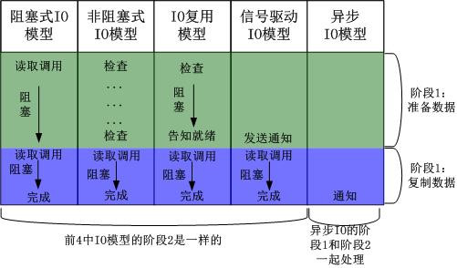

xargs与管道有什么不同呢


**xargs** 将标准输入作为参数输入给命令           echo -l|xargs ls     等于  ls -l

**管道** 将标准输入作为标准输入传给命令     


# du 查看目录大小

du -h --max-depth=2  查看目录大小

du -h -d2 

<https://www.jianshu.com/p/1dcb1e2acff1>

## lsof

lsof(list open files)是一个列出当前系统打开文件的工具。

在linux环境下，任何事物都以文件的形式存在，通过文件不仅仅可以访问常规数据，还可以访问网络连接和硬件。所以如传输控制协议 (TCP) 和用户数据报协议 (UDP) 套接字等，系统在后台都为该应用程序分配了一个文件描述符，无论这个文件的本质如何，该文件描述符为应用程序与基础操作系统之间的交互提供了通用接口。因为应用程序打开文件的描述符列表提供了大量关于这个应用程序本身的信息，因此通过lsof工具能够查看这个列表对系统监测以及排错将是很有帮助的。


# ps

Linux中的ps命令是Process Status的缩写

**ps工具标识进程的5种状态码:** 

D 不可中断 uninterruptible sleep (usually IO) 

R 运行 runnable (on run queue) 

S 中断 sleeping 

T 停止 traced or stopped 

Z 僵死 a defunct (”zombie”) process 


# linux命令语法格式
```
命令 <必选参数1|必选参数2> -option {必选参数1|必选参数2|必选参数3} {(默认参数)|参数|参数}
```

命令格式中常用的几个符号含义如下：

- 尖括号< >：必选参数，实际使用时应将其替换为所需要的参数

- 大括号{ }：必选参数，内部使用，包含此处允许使用的参数

- 方括号[ ]：可选参数，在命令中根据需要加以取舍

- 小括号( )：指明参数的默认值，只用于{ }中

- 竖线|：用于分隔多个互斥参数，含义为“或”，使用时只能选择一个。

- 省略号...：任意多个参数。


# 5种 网络IO模型

**阻塞IO、非阻塞IO、多路复用IO、信号驱动IO、异步IO**

前四个都是同步IO，在内核数据copy到用户程序时都是阻塞的，而第五个则是异步的



## 后台执行 

```
nohup xxxx output.log
```

out.log 如果未定义，则会在同级目录下生成一个nohup.out文件来储存日志信息

通过 `tail -f nohup.out` 查看日志