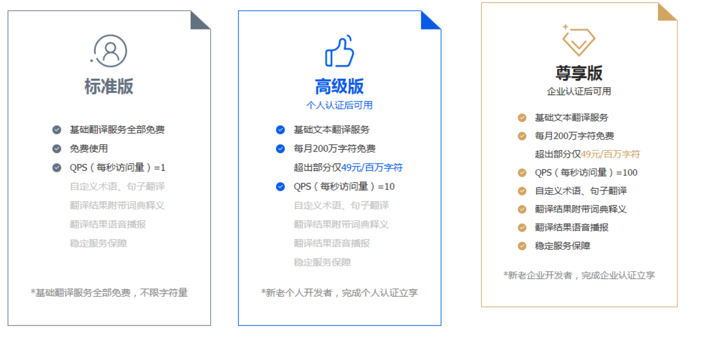

# i18n

在做**spring的国际化时**，是需要准备多语言的，如果 项目庞大，纯粹用人工去翻译成本巨大，所以笔者就使用翻译Api，如 [百度翻译]([http://api.fanyi.baidu.com](http://api.fanyi.baidu.com/)) ， 读者如果不用 百度的，也可以通过修改脚本去替换 api


# 百度翻译

这个时候还是要说下百度的好

本来大家都是用 *google* 翻译的，由于不知名的内外部原因，*google* 翻译不行了，这个时候百度的翻译就很好的解决了问题，而且还 免费，流程简单。

我们只要注册登录，申请应用就可以了，很简单，流程就不写了

特别的说明下，百度翻译是**分等级**的，有钱的小伙伴用 vip 应该会体验好很多，但是手头拮据些的用免费的也是足够使用了，




注意这里的 QPS ，脚本中会对他做 `time.sleep` 如果是 vip **可以注释掉**，快速的完成翻译。

还有一点就是 **不是所有的语言都支持的**，如果有特殊语种需要 恐怕需要另谋其他方法了。


# 脚本源码

## 必要参数

- appid  你的appid
- secretKey  你的密钥
- def_from_lang  默认待翻译的语言（zh）
- from_file_path   待翻译的源文件
- out_put_file_name = 'message_%s.properties'  输出目标语言文件名
- to_lang_map 要翻译的语言和文件名映射

以上是 需要 读者自行去修改填充

## Code

```python
# /usr/bin/env python
# coding=utf8

import hashlib
import time
import requests
import random
import json
import re

api = 'http://api.fanyi.baidu.com/api/trans/vip/translate'
appid = '2019070800031591*'  # 你的appid
secretKey = 'tymR5YEUYQVkK*******'  # 你的密钥
def_from_lang = 'zh'
from_file_path = './message_zh_CN.properties'
out_put_file_name = 'message_%s.properties'
to_lang_map = {
    'en': 'en_GB',
    'ru': 'ru_RU',
}


# 调用百度翻译api 执行翻译
def trans_bd_api(q, to_lang, from_lang=def_from_lang):
    salt = random.randint(32768, 65536)

    md5 = hashlib.md5()
    sign = appid + q + str(salt) + secretKey
    sign = sign.encode('utf-8')
    # print("生成字符串1" + str(sign))
    md5.update(sign)
    sign = md5.hexdigest()
    # print("生成字符串1md5  " + str(sign))

    data = {
        'appid': appid,
        'q': q,
        'from': from_lang,
        'to': to_lang,
        'salt': str(salt),
        'sign': sign
    }
    proxies = {
        "http": "http://127.0.0.1:8888",
        "https": "http://127.0.0.1:8888"
    }

    # 发送请求
    response = requests.get(api, data, proxies=proxies)
    # response = requests.get(api, data)
    '''
    {
        "from": "en",
        "to": "zh",
        "trans_result": [{
            "src": "apple",
            "dst": "苹果"
        }]
    }
    '''

    try:
        json_obj = json.loads(str(response.text))
        result = json_obj['trans_result'][0]['dst']
        print('【' + q + '】      目标语言【' + to_lang + '】      响应的结果【' + result + '】')
        return result
    except:
        print(str(response.text) + '【' + q + '】      目标语言【' + to_lang + '】')
    return '█'


# 翻译完后追加写入到 目标文件
def trans_and_write(key, q):
    for lang in to_lang_map:
        result = trans_bd_api(q, lang)
        out_put_file = out_put_file_name % to_lang_map.get(lang)
        with open(out_put_file, 'a') as f:
            f.write(key + '=' + str(result) + '\n')
            print('[' + out_put_file + ']   【' + key + '=' + result + '】')
        # 非vip 不允许高频率请求接口
        time.sleep(2)


def split_trans_content():
    # 正则 待翻译的文本
    pattern = re.compile(r'^(.*)=(.*)$')

    with open(from_file_path, 'r+', encoding='utf-8') as f:
        for line in f.readlines():
            if pattern.match(line.strip()):
                groups = pattern.match(line.strip()).groups()
                trans_and_write(groups[0], groups[1])


split_trans_content()

```

## 响应结果


# 执行步骤

1. 替换必要参数
2. 将待翻译的文件准备好与`from_file_path` 对应清楚
3. 执行脚本程序
4. 等待后，拿到翻译完成目标文件
5. 如果出错需要查看日志，并删除已翻译的文件（因为是追加写入的）

> 为了调试方便，在执行 `response = requests.get(api, data, proxies=proxies)` 时，笔者 写入了代理服务器去查看请求，如果读者不需要注意需要注释掉


# 错误码列表

