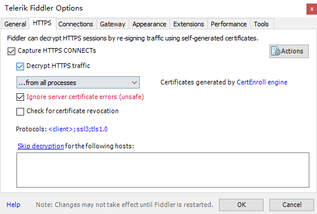
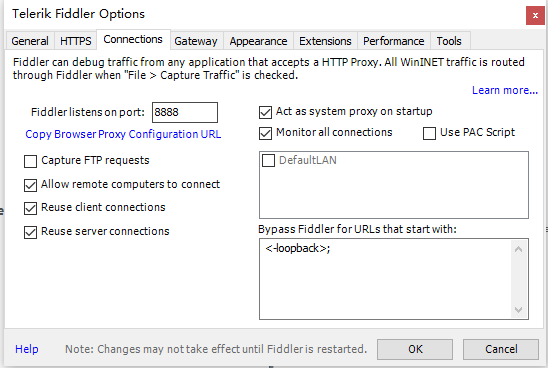
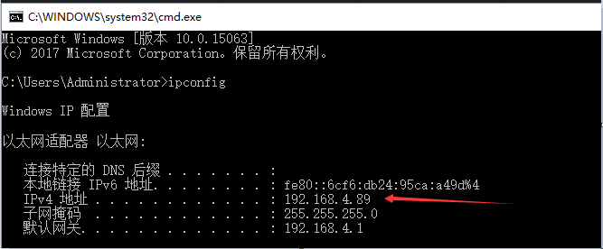
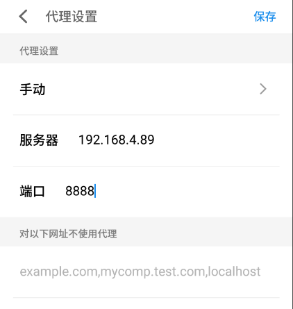
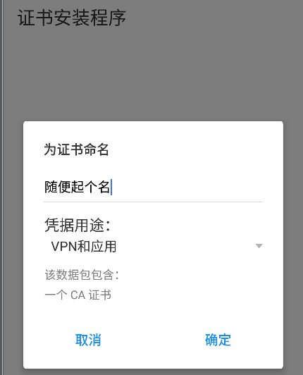

# 抓包

> 抓包（packet capture）就是将网络传输发送与接收的数据包进行截获、重发、编辑、转存等操作，也用来检查网络安全。抓包也经常被用来进行数据截取等。

本文讨论的数据包限于超文本传输协议报文(Http), 也就是通常我们经常用来浏览网页的协议。 除了传统的web端，http协议也广泛应用于移动互联网app与后端服务器的数据交互。其实网络底层为了保证协议的传输准确和效率做了许多事情.

对于Http协议的理解我们可以通俗解释了，**询问和回答**。客户端（可以是手机，电脑或其他网络设备）对远程服务器发出 **询问数据**，远程服务器（可以理解为不关机的稳定电脑）收到询问，就会发回相对应的 **响应数据**。完成这一次数据交互就需要网络的支持，比如wifi，4G都是。我们的目的就是在这些网络出入口抓取、查看这些数据交互

> Fiddler是一个http协议调试代理工具，它能够记录并检查所有你的电脑和互联网之间的http通讯，设置断点，查看所有的"进出"Fiddler的数据

Fiddler 帮我们做了这件事件。这么6，那我们就试着安装使用下。

# Fiddler 安装和使用

去 [https://www.telerik.com/fiddler](https://www.telerik.com/fiddler) 下载 Fiddler 并安装。

安装完成，打开Fiddler。在Tools中选择 Fiddler Options 。选择选项 HTTPS 在apture HTTPS CONNECTs前打钩。

继续选择选项Connections，按下图钩选。注意到 Fiddler listens on port:8888。这是Fiddler默认的监听端口。也就是我们在设置代理时使用的端口号。一般保持不变就好。

# 手机设置

Ok, 现在我们已经设置完了Fiddler，接下来就是让手机连入这个网络，

* 完成这个首先要确保手机和安装有Fiddler的计算机处在同一个局域网中，可以使用路由器，或者使用笔记本发送热点给手机使用。

* 然后查看计算机的IPv4地址，运行命令行（Cmd）输入ipconfig 显示如下图。

* 确定手机连入相同网络后，打开选中手机的wifi，长按或者点设置进入修改网络，输入代理设置

* 最后用浏览器打开刚才获取到的[ ip地址+ :8888] 如 192.168.4.89:8888

* 进入页面，点击下载 FiddlerRoot certificate ,随便起个名（如果手机没有设置安全锁，是需要用户设置的）

依次完成 安装配置完成后，会是这个样子

就这样，我们就能愉快的拦截到手机的网络交互了

# 坑

上面我们所做的是针对整个android设备（系统层）的网络进行拦截，因为我们安装了拦截用的证书，所有系统会提示我们 你的网络被监控了等等。

不过不怕，我们自己做了什么，自己心里还是有点B树的。

更糟糕的是，Android 7.0 调整了网络的安全性配置，提到默认情况下，针对API Level 24及更高版本的应用程序不再信任用户或管理员添加的CA用于安全连接。也就是需要应用程序的配合才能抓包了。所以建议用低于7.0的设备抓包。

配置方法参考官网
[https://developer.android.com/training/articles/security-config.html](https://developer.android.com/training/articles/security-config.html)
