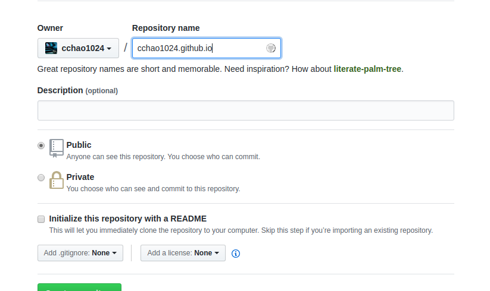

# 安装 Hexo
> Hexo 是一个快速、简洁且高效的博客框架。Hexo 使用 [Markdown](http://daringfireball.net/projects/markdown/)（或其他渲染引擎）解析文章，在几秒内，即可利用靓丽的主题生成静态网页。

Hexo 的安装需要依赖于

* [node.js](https://nodejs.org)
* [Git](git-scm.com)

下载安装依赖后，执行命令
```
$ sudo npm install -g hexo-cli
```
通过 **hexo -v** 可以查看当前系统环境的依赖版本。

# 创建博客网站
在指定文件夹（博客环境位置）执行命令，即可完成博客环境的初始化
```
$ hexo init <folder>
$ cd <folder>
$ npm install
```
完成后的目录结构
```
.
├── _config.yml
├── package.json
├── scaffolds
├── source
|   ├── _drafts
|   └── _posts
└── themes
```
可以通过修改**_config.yml** 完成博客网站的配置（如： 标题，作者，语言等）。

# 创建配置博客网站
在指定文件夹（博客环境位置）执行命令，即可完成博客环境的初始化
```
$ hexo init <folder>
$ cd <folder>
$ npm install
```
完成后的目录结构
```
.
├── _config.yml
├── package.json
├── scaffolds
├── source
|   ├── _drafts
|   └── _posts
└── themes
```
可以通过修改**_config.yml** 完成博客网站的配置（如： 标题，作者，语言等）。
# 创建文章，本地部署
* 输入 **hexo new post "article title"** 新建一篇文章

  （在 **source/_posts**  可以看到该MD 文章文件）

* 将图片放在image目录下可以对其进行相对路径引用

* 通过 **hexo g** 生成静态网页

* 执行 **hexo s** 即可完成博客内容的本地部署
  

访问 [http://localhost:4000](http://localhost:4000) 就能看到效果了。

# 关联 Github

* 登录Github帐号，新建仓库，名为  **<用户名>.github.io**  固定写法。
  

1. 安装部署拓展
```
npm install hexo-deployer-git --save
```
2. 建立关联
    修改配置文件 **_config.yml** 的 deploy
```
deploy:
    type: git
    repository: https://github.com/<用户名>/<用户名>.github.io.git
    branch: master
```
3. 保存 github 账号信息到终端，两种方式：
* ssh 本地生成非对称秘钥，将公钥放在github
* 保存账号密码到终端
4. 部署修改
    通过 **hexo d -g** 部署本地的博客文件到github


# Ref

[https://hexo.io/zh-cn/docs/](https://hexo.io/zh-cn/docs/)