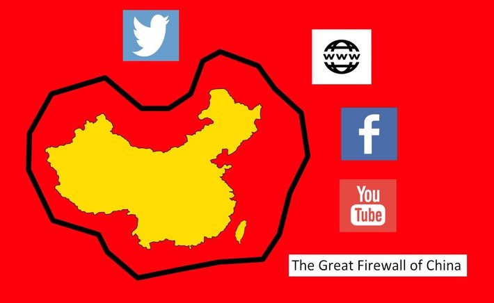
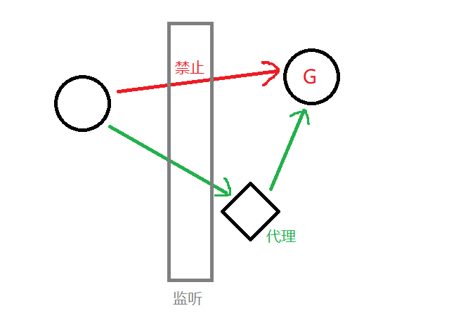

# 防火墙

> 防火墙（英文：Firewall）是一个架设在互联网与内网之间的资安系统，根据预定的策略来监控往来的数据传输。

防火长城（英语：Great Firewall (of China)，常用简称：GFW，是对中华人民共和国政府在其互联网边界审查系统（包括相关行政审查系统）的统称。此系统起步于1998年，其英文名称得自于2002年5月17日Charles R. Smith所写的一篇关于中国网络审查的文章，取与Great Wall（长城）相谐的效果，简写为Great Firewall，缩写GFW。随着使用的拓广，中文"墙"和英文"GFW"有时也被用作动词，网友所说的"被墙"即指被防火长城所屏蔽，"翻墙"也被引申为浏览境外网站的行为。



一般情况下，防火长城主要指中国政府监控和过滤互联网国际出口上内容的软硬件系统的集合。但中国政府并进一步设置将查获的特定网点阻断等，造成大家所熟知的连接错误现象，因此防火墙不是中国特有的一个专门单位，是由分散部门的各服务器和路由器等设备，加上相关公司的应用程序所构成，是一个跨军民合作的大型信息管制系统，防火长城的作用主要是监控国际网关上的通讯，对部分的传输内容，进行干扰、阻断、屏蔽。含有"不合适"内容的网站，会受到政府直接的行政干预，被要求自我审查、自我监管，乃至关闭，故防火长城主要作用在于分析和过滤中国境外网络的信息互相访问。

# 墙的主要技术

## DNS污染

> 防火长城对所有经过骨干出口路由的在UDP的53端口(域名解析)进行监测，一经发现与 **黑名单列表** 相匹配的域名查询请求，防火长城会伪装成目标域名的解析服务器给查询者返回虚假结果。由于通常的域名查询没有任何认证机制，而且域名查询通常基于的UDP协议是无连接不可靠的协议，查询者只能接受最先到达的格式正确结果，并丢弃之后的结果。用户若改用TCP在53端口上进行DNS查询，虽然不会被防火长城污染，但可能会遭遇连接重置，导致无法获得目标网站的IP地址。

当我们访问某一墙外网站时，最新需要的就是根据域名获取到相应网站的IP地址，而墙就会在主干网络（比如 上海的路由中转）返回错误的IP地址，我们拿到这个错误的IP自然无法正确访问到数据。

应对DNS污染，我们想到了如果我们直接通过访问网站的IP地址（不是域名），是不是意味着不进行域名解析了，不需要访问DNS服务器了，也就不被误导去错误的地址了。

那问题来了，我们不通过域名解析怎么能知道正确的网站IP呢？

社区从来不缺乐于助人的工程师。<https://github.com/racaljk/hosts> 通过他人分享的host文件替换自己本地的就阔以了。

没错，我们就是这么一群品德高尚、心地善良的人，捂脸。

## IP封锁

既然我们可以通过IP直接访问网站，是不是墙也可以屏蔽掉这个IP的访问请求呢？没错，它确实这么做了，在以前墙有一张 **访问控制列表**，就是一张映射表，列出某某IP可以访问，某某IP不可以。在主干路由对传输的IP报文的目标地址进行比较，决定改报文是否能正确送达。

后面被 **路由扩散技术** 替代了，该技术理解为，网络管理员通过 **静态路由协议** 在某一主干路由故意把特定IP路由到错误的服务器，然后其他相邻路由根据 **动态路由协议** 在进行分享路由信息时，就也拿到了错误的路由路径。。。然后整个局域网对该IP的路由信息都是错的。

假设网络管理者在配置的时候故意将IP路由到一台接受所有数据的服务器（**黑洞服务器**），他就能收集所有对封锁IP的网络交互，可能还返回引导向善之类的页面。

以前一个IP可能不仅仅对应一个网站（**VPS 虚拟主机服务**）,所有墙的这种方式很容易误伤，比如我是守法公民，刚好和坏坏的网站使用同一个虚拟主机服务提供商且分到了同一个ip（端口不一样），就被误杀了。所有，墙就把封锁粒度调到端口了，针对特定的 [IP+端口] 封锁。

# 代理
## HTTP代理

既然IP不能直接访问了，那是不是可以通过中间人访问到目标地址呢。举个例子。

上课时小明想给小红小纸条，但是班主任看着呢。小明就假假的和学习委员讨论问题，然后委托学习委员把纸条给小红，学习委员又假假的和小红讨论问题，最后把纸条给了小红。学习委员在这个场景里就是 **代理服务器**。



在上面的场景中，我们知道了代理的工作机制，

但是互联网不像我们普通的沟通，没协议你说个球呀。所以我们熟悉的Http就先上了。

HTTP代理很简单，就是墙内 **客户端A** 试图与 **服务器B** 进行数据交互。但是直接连接受限制了，于是A和B就通过 **代理服务器C** 转发数据完成交互，这里C与A或B的通讯应不受限制。

首先A和 **代理服务器C** 建立TCP连接，然后通过Http(S)协议发起 **CONNECT 请求** 告诉C去连接目标服务器B。

```

CONNECT www.google.com:80 HTTP/1.1
Host: www.google.com:80
Proxy-Connection: Keep-Alive
Proxy-Authorization: Basic + [BASE64编码的账号和密码]
Content-Length: 0

```

C在收到请求并验证身份完成后发出响应。

```
HTTP/1.1 200 Connection Established

```

至此，代理服务器就确定了自己作为 **中间人** 的角色完成双方的数据通讯。

A在收到C的响应后，就把原先要发送给B的数据发送给C，C再转交给B（数据回传也同理），这里需要注意的在 **完成代理关系确定后，A和B的通讯不仅仅是HTTP协议了 ，他们可以是其他TCP/IP协议。** 如：POP2、SMTP、FTP等等。

虽然HTTP代理看上去应该是阔以的，但是不要忘了，请求行是文明传输的，你想要发CONNET连接的时候各大的主干路由都知道了。拿你的目标地址和黑名单比对，匹配上了就把你的包肆意处理了。然后就没有然后了。。。

## VPN

从上面Http代理的惨痛失败中我们可以知道，任何明文的传输都会把自己的想法暴露出去。所以理所当然的我们想到了加密传输，而且要先建立加密连接（不暴露目标服务器信息）然后再发送目标数据。这个加密连接我们称为 **隧道**，建立该隧道的协议称为 **隧道协议**。
VPN（虚拟专用网Virtual Private Network）就是利用隧道协议来进行通讯的，客户端先与VPN服务器认证，建立隧道，然后再通过隧道发送加密的数据，经过VPN服务器的代理中转送达目标服务器。可想而知VPN提供商是能知道客户端与目标服务器通讯的所有报文的，所以通讯内容其实是不隐秘的。其次墙虽然不知道你的目标服务器，但是他可以感知某个VPN服务器被大量的客户端频繁访问，然后搞事情。

隧道协议有许多种实现，比如：

基于数据包:

* IPsec
* 一般路由封装（GRE），支持多种网络层协议和多路技术
* IP in IP[2]，比GRE更小的负载头，并且适合只有负载一个IP流的情况。
* L2TP（数据链接层隧道协议）[3]
* MPLS （多协议标签交换）
* GTP
* PPTP（点对点隧道协议） [4]
* PPPoE（基于以太网的点对点隧道）
* PPPoA（基于ATM的点对点隧道）
* IEEE 802.1Q （以太网VLANs）
* DLSw（英语：DLSw） (SNA负载互联网协议)
* XOT（英语：XOT） (X.25数据片负载TCP)
* IPv6 穿隧：6to4、6in4、Teredo

基于流:

* 传输层安全
* SSH
* SOCKS
* HTTP CONNECT 命令

## SSH

> SSH的英文全称是Secure SHell。通过使用SSH，你可以把所有传输的数据进行加密，这样“中间人”这种攻击方式就不可能实现了，而且也能够防止DNS和IP欺骗。还有一个额外的好处就是传输的数据是经过压缩的，所以可以加快传输的速度。SSH有很多功能，它既可以代替telnet，又可以为ftp、pop、甚至ppp提供一个安全的“通道”。SSH是由客户端和服务端的软件组成的，有两个不兼容的版本分别是：1.x和2.x。用SSH 2.x的客户程序是不能连接到SSH 1.x的服务程序上去的。OpenSSH 2.x同时支持SSH 1.x和2.x。

SSH 提供两种级别的安全验证

 * 第一种级别（基于口令的安全验证） 只要你知道自己帐号和口令，就可以登录到远程主机。所有传输的数据都会被加密，但是不能保证你正在连接的服务器就是你想连接的服务器。可能会有别的服务器在冒充真正的服务器，也就是受到“中间人”这种方式的攻击。
 * 第二种级别（基于密匙的安全验证） 需要依靠密匙，也就是你必须为自己创建一对密匙，并把公用密匙放在需要访问的服务器上。如果你要连接到SSH服务器上，客户端软件就会向服务器发出请求，请求用你的密匙进行安全验证。服务器收到请求之后，先在你在该服务器的Home目录下寻找你的公用密匙，然后把它和你发送过来的公用密匙进行比较。如果两个密匙一致，服务器就用公用密匙加密“质询”（challenge）并把它发送给客户端软件。客户端软件收到“质询”之后就可以用你的私人密匙解密再把它发送给服务器。用这种方式，你必须知道自己密匙的口令。

 与第一种级别相比，第二种级别不需要在网络上传送口令。第二种级别不仅加密所有传送的数据，而且“中间人”这种攻击方式也是不可能的（因为他没有你的私人密匙）。但是整个登录的过程可能需要10秒。

## SOCKS

> SOCKS是一种 **会话层网络代理协议** ，主要用于客户端与外网服务器之间通讯的中间传递

同样是代理协议 SOCKS工作的层级和HTTP代理更低。我们知道HTTP是应用层协议，需要建立TCP链接,发了HTPP的CONNECT代理请求（这个时候暴露了目标服务器地址）代理才能走通，而且该代理也只能转发TCP报文。而SOCKS5支持UDP和TCP。

其转发过程可以概括如下：

1. 代理服务器B 监听发给1080端口，客户端A 与代理服务端 **建立TCP连接**（3次握手） （1-3）
2. 客户端A 发送支持的 **认证方式列表** ，代理服务器B 发送报文收到的响应 （4-5）
3. 代理服务器B 发送 **选择响应认证方式** ，客户端A发送报文收到的响应 （6-7）
4. （认证过程，无需认证就跳过该步骤）
5. 客户端A 发送 **连接目标服务器的请求**，包含目标服务器IP，端口，连接方式（TCP/IP流、TCP/IP端口、UDP端口），地址类型（域名、IPV4、IPV6）,代理服务器B 发送报文收到的响应 （8-9）
6. 代理服务器B **发送对代理请求的响应**，包含目标服务器IP，端口等。客户端A发送报文收到的响应（10-11）
7. 客户端A向目标服务器发送HTTP请求（或者其他基于TCP/UDP的协议），代理服务器B 发送报文收到的响应（12-13）
8. 代理服务器B 对目标服务器 **发送HTTP请求**，目标服务器发送HTTP响应。
9. 代理服务器B 对客户端A **转发HTTP响应**，客户端A 发送报文收到的响应 （14-15）
10. TCP四次挥手，**关闭连接** （16-19）

## SSH + SOCKS

> 由于SOCKS是明文传输的，所以这样直接明目张胆的传输数据肯定是不对嘀。从上文我们知道SSH是可以建立加密的通讯隧道。

SO 我可以这样，通过SSH 建立加密的隧道，然后 SSH服务端 转发我们的请求给 SOCKS服务器程序（端口1080）。

```
ssh -f -C2qTnN -D 1080 <username>@<remote SSH server>

```

* -f  后台运行
* -C 压缩
* -2 只支持版本2协议
* -q 静默模式
* -T 禁用伪终端分配
* -n  阻止从标准输入读取。后台运行的话，必须使用。
* -N 不执行远程命令
* -D [bind_address : ] port **本地动态应用级端口转发**。没有指定address将监听在127.0.0.1上。

## Shadowsocks

**Shadowsocks** Shadowsocks是通过协定好客户端和代理服务器使用的 **对称加密算法**。

客户端发过去的时候加密，SS代理收的时候解密，解密获取到明文的请求信息后对目标服务器发起请求。SS代理收到响应后加密回传给客户端。
