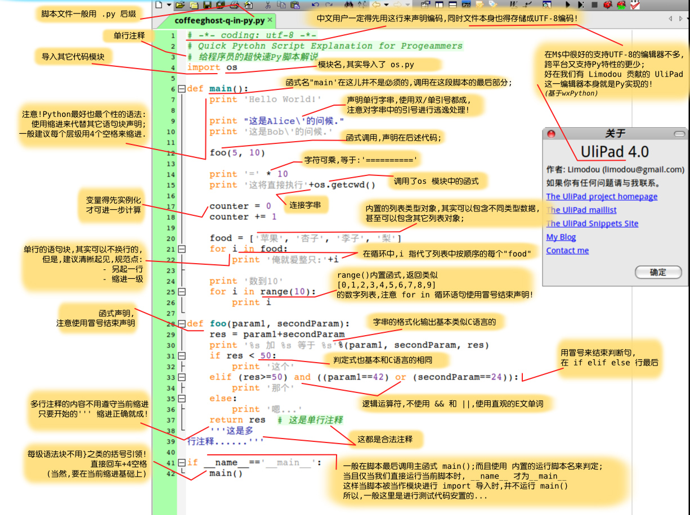

# 看图识语法



## list 可变的有序表

```
list = ['a','B',17]
list.append('c')
list.pop() #弹出最后一个
list.insert(1,'k')
list.pop(1)
printf(list[2])
list = [] #空的list
```
## tuple 不可变的有序列表

```
tuple = ('a','B',17)
printf(tuple[2])
tuple = ()#空的list
tuple = (1,)#只有1个元素的tuple须加逗号，来消除歧义
tuple = ('a', 'b', ['A', 'B'])#tuple里放list则list的元素可变
```

## dict 字典 ( map )

```
d = {'Michael': 95, 'Bob': 75, 'Tracy': 85}
printf(d['Michael'])
d.get('Thomas')
d.get('Thomas', -1) #无 返回-1
d.pop('Bob')#删除Bob
d['Adam'] = 67
```
## set 无序和无重复的集合,需要提供list作为输入

```
s = set([1, 1, 2, 2, 3, 3])#重复元素会被过滤
s.add(4)
s.remove(2)
s2=set([2,3])
print( s&s2 )
```
## 切片

```
L = ['Michael', 'Sarah', 'Tracy', 'Bob', 'Jack']
L[:3]
L[0:3] #['Michael', 'Sarah', 'Tracy']
L[-2:] #['Bob', 'Jack']
L[-2:-1] #['Bob']
L = list(range(100))
L[:10] #[0, 1, 2, 3, 4, 5, 6, 7, 8, 9]
L[-10:] #[90, 91, 92, 93, 94, 95, 96, 97, 98, 99]
L[:10:2] #[0, 2, 4, 6, 8]
L[::5] #[0, 5, 10, 15, 20, 25, 30, 35, 40, 45, 50, 55, 60, 65, 70, 75, 80, 85, 90, 95]
L[:] #复制一个list
'ABCDEFG'[::2] #'ACEG'
```
## 列表生成器

```
L = ['Hello', 'World', 'IBM', 'Apple']
print([s.lower() for s in L]) # ['hello', 'world', 'ibm', 'apple']
d = {'x': 'A', 'y': 'B', 'z': 'C' }
for k, v in d.items():
	print(k, '=', v)
```
## 生成器Generator
```
#第一种方法很简单，只要把一个列表生成式的[]改成()，就创建了一个generator：
>>> L = [x * x for x in range(10)]
[0, 1, 4, 9, 16, 25, 36, 49, 64, 81]
>>> g = (x * x for x in range(10))
next(g) 0
next(g) 1
next(g) 4
#一种方法。如果一个函数定义中包含yield关键字，那么这个函数就不再是一个普通函数，而是一个generator：
def fib(max):
    n, a, b = 0, 0, 1
    while n < max:
        yield b
        a, b = b, a + b
        n = n + 1
    return 'done'
#如果想要拿到返回值，必须捕获StopIteration错误，返回值包含在StopIteration的value中：
>>> g = fib(6)
>>> while True:
    try:
        x = next(g)
        print('g:', x)
   except StopIteration as e:
        print('Generator return value:', e.value)
        break
```

## function

	​```
	# 默认参数
	def power(x, n=2，y=[]) #若不传参数n,y，则n的值为2，y为空list
	
	# 可变参数 在函数调用时自动组装为一个tuple
	def calc(*numbers)
	nums = [1, 2, 3]
	calc(*nums) #在list或tuple前面加一个*号，把list或tuple的元素变成可变参数传进去
	
	# 关键字参数 在函数内部自动组装为一个dict
	def person(name, age, **kw)
	
	# 命名关键字 命名关键字参数需要分隔符*，*后面的参数被视为命名关键字参数。
	def person(name, age, *, city='Beijing', job)
	
	person('Jack', 24, job='Engineer') #命名关键字参数必须传入参数名
	
	# 参数定义的顺序必须是：必选参数、默认参数、可变参数、命名关键字参数和关键字参数。
	def f2(a, b, c=0, *, d, **kw):
	​```

## 模块


```
#!/usr/bin/env python3
# -*- coding: utf-8 -*-

' 文档注释(任何模块代码的第一个字符串都被视为模块的文档注释) '

__author__ = '作者名'
```

* 正常的函数和变量名是公开的（public）
* 类似__xxx__这样的变量是特殊变量
* 类似_xxx为约定私有，但仍可访问
* 类似__xx为私有变量，只有内部可以访问，外部不能访问
  Python中，安装第三方模块，是通过包管理工具pip完成的。

## 继承和多态
```
class Dog(Animal):
c = Dog() # c是Dog类型
isinstance(c, Animal) # True
# 判断对象类型，使用type()函数
type(123)==type(456) # True
>>> type(fn)==types.FunctionType
True
>>> type(abs)==types.BuiltinFunctionType
True
>>> type(lambda x: x)==types.LambdaType
True
>>> type((x for x in range(10)))==types.GeneratorType
True

```
Python是动态语言，根据类创建的实例可以任意绑定属性。

给实例绑定属性的方法是通过实例变量，或者通过self变量：

```
class Student(object):
    def __init__(self, name):
        self.name = name

s = Student('Bob')
s.score = 90
```
Student类本身需要属性,可以直接在class中定义属性，这种属性是类属性，归Student类所有：( 静态 ）

```
class Student(object):
    name = 'Student'
```
当我们定义了一个class，创建了一个class的实例后，我们可以给该实例绑定任何属性和方法，这就是动态语言的灵活性

```
class Student(object):
    pass

# 实例绑定一个属性
>>> s = Student()
>>> s.name = 'Michael' # 动态给实例绑定一个属性
>>> print(s.name)
Michael

# 给实例绑定一个方法
>>> def set_age(self, age): # 定义一个函数作为实例方法
...     self.age = age
...
>>> from types import MethodType
>>> s.set_age = MethodType(set_age, s) # 给实例绑定一个方法
>>> s.set_age(25) # 调用实例方法
>>> s.age # 测试结果
25

# 给所有实例都绑定方法，可以给class绑定方法
>>> def set_score(self, score):
...     self.score = score
...
>>> Student.set_score = set_score

# 限制实例的属性
class Student(object):
    __slots__ = ('name', 'age') # 用tuple定义允许绑定的属性名称

>>> s = Student() # 创建新的实例
>>> s.name = 'Michael' # 绑定属性'name'
>>> s.age = 25 # 绑定属性'age'
>>> s.score = 99 # 绑定属性'score'
Traceback (most recent call last):
  File "<stdin>", line 1, in <module>
AttributeError: 'Student' object has no attribute 'score'
```

## 元类
可以理解为 两种方式创建类 type和metaclass

* type()

 * 可以查看一个类型或变量的类型
 * 可以返回一个对象的类型
 * 可以创建出新的类型

```
# 创建Hello class (类名,父类,方法)
Hello = type('Hello', (object,), dict(hello=fn))
```
* metaclass metaclass允许你创建类或者修改类

```
# metaclass是类的模板，所以必须从`type`类型派生：
class ListMetaclass(type):
    def __new__(cls, name, bases, attrs):
        attrs['add'] = lambda self, value: self.append(value)
        return type.__new__(cls, name, bases, attrs)
class MyList(list, metaclass=ListMetaclass):
    pass
```
## IO读写

```
#相当于try ... finally，并且不必调用f.close()方法。
with open('/path/to/file','r+',encoding='gbk', errors='ignore') as f:
    for line in f.readlines():
    print(line.strip()) # 把末尾的'\n'删掉
	f.write('Hello, world!')
```
read() 会一次性读取文件的全部内容
read(size) 读取size大小的数据
readline() 读取一行一行

```
w：以写方式打开
a：以追加模式打开 (从 EOF 开始, 必要时创建新文件)
r+：以读写模式打开
w+：以读写模式打开 (参见 w )
a+：以读写模式打开 (参见 a )
rb：以二进制读模式打开
wb：以二进制写模式打开 (参见 w )
ab：以二进制追加模式打开 (参见 a )
rb+：以二进制读写模式打开 (参见 r+ )
wb+：以二进制读写模式打开 (参见 w+ )
ab+：以二进制读写模式打开 (参见 a+ )

1.创建目录
	os.mkdir("file")                   
2.复制文件：
	shutil.copyfile("oldfile","newfile") #oldfile和newfile都只能是文件
	shutil.copy("oldfile","newfile") #oldfile只能是文件夹，	newfile可以是文件，也可以是目标目录
3.复制文件夹：
	shutil.copytree("olddir","newdir") #olddir和newdir都只能是目录，且newdir必须不存在
4.重命名文件（目录）
	os.rename("oldname","newname") #文件或目录都是使用这条命令
6.移动文件（目录）
	shutil.move("oldpos","newpos")   
7.删除文件
	os.remove("file")
8.删除目录
	os.rmdir("dir") #只能删除空目录
	shutil.rmtree("dir") #空目录、有内容的目录都可以删
9.转换目录
	os.chdir("path") #换路径
```
## 多线程

```
import time, threading

# 新线程执行的代码:
def loop():
    print('thread %s is running...' % threading.current_thread().name)
    n = 0
    while n < 5:
        n = n + 1
        print('thread %s >>> %s' % (threading.current_thread().name, n))
        time.sleep(1)
    print('thread %s ended.' % threading.current_thread().name)

print('thread %s is running...' % threading.current_thread().name)
t = threading.Thread(target=loop, name='LoopThread')
t.start()
t.join()
print('thread %s ended.' % threading.current_thread().name)
#result:
thread MainThread is running...
thread LoopThread is running...
thread LoopThread >>> 1
.....
thread LoopThread >>> 5
thread LoopThread ended.
thread MainThread ended.

# 锁
balance = 0
lock = threading.Lock()

def run_thread(n):
    for i in range(100000):
        # 先要获取锁:
        lock.acquire()
        try:
            # 放心地改吧:
            change_it(n)
        finally:
            # 改完了一定要释放锁:
            lock.release()
```
## re

```
>>> import re
# 编译:
>>> re_telephone = re.compile(r'^(\d{3})-(\d{3,8})$')
# 使用：
>>> re_telephone.match('010-12345').groups()
('010', '12345')
>>> re_telephone.match('010-8086').groups()
('010', '8086')

# findall
def regex(s):
    pattern_text = r'.+(?=\n)'
    pattern = re.compile(pattern_text)
    for x in pattern.findall(s):
        print(x)
```

# 异常处理

```python
try:
    fh = open("testfile", "w")
    fh.write("这是一个测试文件，用于测试异常!!")
except IOError:
    print "Error: 没有找到文件或读取文件失败"
else:
    # 如果没有异常执行这块代码
    print "内容写入文件成功"
    fh.close()
```

except 后面可以跟任意多个异常类型（0个也可以），表示捕获不同异常

