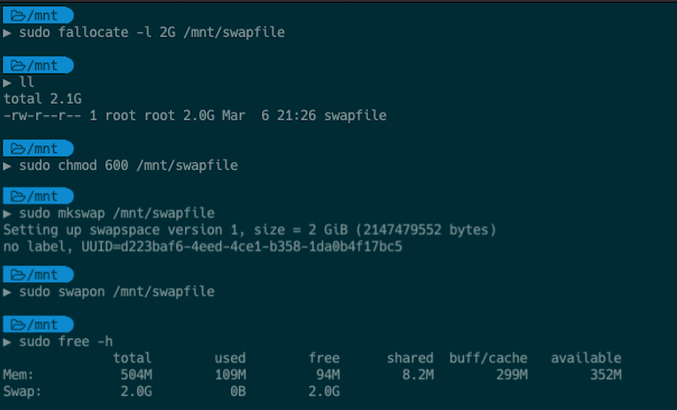

# Swap Space
> 交换区是当今计算的一个常见方面，与操作系统无关。
> Linux使用交换空间来增加主机可用的虚拟内存数量。它可以在常规文件系统或逻辑卷上使用一个或多个专用交换分区或交换文件。

Linux内核为了提高读写效率与速度，会将文件缓存在内存中，这部分内存就是**Cache Memory(缓存内存)。**
即使你的程序运行结束后，缓存内存也不会自动释放。这就会导致你在Linux系统中程序频繁读写文件后，你会发现可用物理内存在变少，当不够用的时候，就需要 **挪出** 部分空间，以供当前运行的程序使用。
那些被腾出的内存空间可能来自一些长时间没有什么操作的程序，这些空间被**临时保存**到Swap空间中，等到那些程序要运行时，再从Swap分区中**恢复保存的数据到内存中**。
这样，系统总是在物理内存不够时，才进行Swap交换。
> 所以交互区这个词是非常准确的，它把不重要的程序挪到速度较慢的硬盘交互区中。多出来的内存空间给优先级高的程序。像是做了位置交换。
> 这样就凭空多了一部分（交换区空间）可以使用的内存空间。
# 分配规则

系统在什么情况或条件下才会使用Swap分区的空间呢？ 
Linux通过一个参数swappiness来控制的。当然还涉及到复杂的算法。
这个参数值可为 **0-100**，控制系统 swap 的使用程度。
高数值可优先系统性能，在进程不活跃时主动将其转换出物理内存。
低数值可优先互动性并尽量避免将进程转换处物理内存，并降低反应延迟。

0 就是最大限度使用内存，尽量不使用swap；
100 是积极使用swap  **默认60**
```
# 查看分配规则 该参数范围为0-100。
cat  /proc/sys/vm/swappiness
```
查看当前交换区的状态
```
swapon -s
cat /proc/swaps
```

# 开启交换区
**01. 创建swap文件**
```
# 通过 fallocate 创建 swap文件
sudo fallocate -l 2G /mnt/swapfile
# 如果系统找不到 **fallocate** 命令（需要安装），也可以通过 dd 创建

# bs: 一次读取和写入的字节  count: 总数     
dd if=/dev/zero of=/mnt/swapfile bs=2M count=1024
```
**02. 修改交换文件权限**
仅root用户可读写 swap文件
```
sudo chmod 600 /mnt/swapfile
```
**03. 设置交换区**
```
sudo mkswap /mnt/swapfile
```
**04. 开启交换区，查看状态** 
```
sudo swapon /mnt/swapfile
sudo free -h
```
**05. 开机启动**

```
vim /etc/fstab 添加行
/mnt/swapfile swap swap defaults 0 0
```


# 其他
sync                         # 先执行下同步
swapoff -a                   # 关闭swap分区
swapon -a                    # 开启swap分区
swapoff -a && swapon -a      # 刷新swap空间，即将SWAP里的数据转储回内存，并清空SWAP里的数据。刷新原理就是把swap关闭后再重启。

# Refrences
[https://www.wikiwand.com/zh-hans/%E8%99%9A%E6%8B%9F%E5%86%85%E5%AD%98](https://www.wikiwand.com/zh-hans/%E8%99%9A%E6%8B%9F%E5%86%85%E5%AD%98)
[https://opensource.com/article/18/9/swap-space-linux-systems](https://opensource.com/article/18/9/swap-space-linux-systems)
[https://www.tecmint.com/create-a-linux-swap-file/](https://www.tecmint.com/create-a-linux-swap-file/)
[http://www.cnblogs.com/kerrycode/p/5246383.html](http://www.cnblogs.com/kerrycode/p/5246383.html)